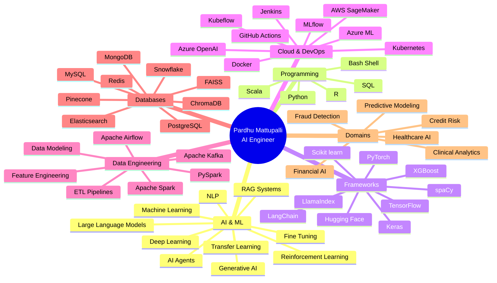

<!-- 
████████╗██╗  ██╗███████╗    ███████╗██╗   ██╗████████╗██╗   ██╗██████╗ ███████╗
╚══██╔══╝██║  ██║██╔════╝    ██╔════╝██║   ██║╚══██╔══╝██║   ██║██╔══██╗██╔════╝
   ██║   ███████║█████╗      █████╗  ██║   ██║   ██║   ██║   ██║██████╔╝█████╗  
   ██║   ██╔══██║██╔══╝      ██╔══╝  ██║   ██║   ██║   ██║   ██║██╔══██╗██╔══╝  
   ██║   ██║  ██║███████╗    ██║     ╚██████╔╝   ██║   ╚██████╔╝██║  ██║███████╗
   ╚═╝   ╚═╝  ╚═╝╚══════╝    ╚═╝      ╚═════╝    ╚═╝    ╚═════╝ ╚═╝  ╚═╝╚══════╝
                    ██████╗ ███████╗    ███╗   ███╗██╗     
                   ██╔═══██╗██╔════╝    ████╗ ████║██║     
                   ██║   ██║█████╗      ██╔████╔██║██║     
                   ██║   ██║██╔══╝      ██║╚██╔╝██║██║     
                   ╚██████╔╝██║         ██║ ╚═╝ ██║███████╗
                    ╚═════╝ ╚═╝         ╚═╝     ╚═╝╚══════╝
-->

<div align="center">

</div>

<div align="center">


</div>

```bash
┌─[pardhu@ai-terminal]─[~/professional-identity]
└──╼ $ whoami
Pardhu Mattupalli • AI Engineer • ML Systems Architect • Production AI Specialist

┌─[pardhu@ai-terminal]─[~/career-stats]
└──╼ $ ls -la
drwxr-xr-x  3+ years of AI/ML engineering experience
drwxr-xr-x  10+ production AI systems deployed
-rw-r--r--  47% data processing time reduction achieved
-rw-r--r--  35% improvement in clinical data analysis speed
-rw-r--r--  25% boost in fraud detection accuracy
-rw-r--r--  18% lift in model performance metrics
-rw-r--r--  30% reduction in prediction latency
-rw-r--r--  50+ technologies mastered across AI/ML stack

┌─[pardhu@ai-terminal]─[~/specializations]
└──╼ $ cat expertise.txt
• Generative AI & Large Language Models (LLMs)
• Retrieval-Augmented Generation (RAG) Systems
• Production MLOps & Model Deployment
• Healthcare & Financial AI Solutions
• Real-Time Predictive Analytics Pipelines
• HIPAA, GDPR, RBI Compliance & Secure AI
```

<table align="center">
<tr>
<td></td>
<td></td>
<td></td>
</tr>
</table>

<div align="center">

[](https://www.linkedin.com/in/pardhu--mattupalli?utm_source=share_via&utm_content=profile&utm_medium=member_ios)
[](https://github.com/pmattupalli26)
[](mailto:pmattupalli26@gmail.com)

</div>

---

## 🎯 PROFESSIONAL IDENTITY

<table width="100%">
<tr>
<td width="50%" valign="top">

```typescript
class AIEngineer implements ProductionMLExpert {
  private identity = {
    name: "Pardhu Mattupalli",
    title: "AI Engineer",
    location: "New Jersey, USA",
    experience: "3+ years"
  };

  private expertise: TechStack = {
    languages: [
      "Python", "SQL", "R", 
      "Scala", "Bash/Shell"
    ],
    aiSpecialties: [
      "Machine Learning",
      "Deep Learning",
      "Generative AI",
      "Large Language Models",
      "NLP", "RAG Systems",
      "AI Agents", "Fine-Tuning"
    ],
    frameworks: [
      "PyTorch", "TensorFlow",
      "Scikit-learn", "XGBoost",
      "LangChain", "LlamaIndex",
      "Hugging Face Transformers"
    ]
  };
}
```

</td>
<td width="50%" valign="top">

```python
class ProductionAIArchitect:
    def __init__(self):
        self.impact_metrics = {
            'experience_years': 3,
            'domains': ['Healthcare', 'Financial'],
            'projects_delivered': 10,
            'data_processing_improvement': '47%',
            'clinical_analysis_speedup': '35%',
            'fraud_detection_boost': '18%',
            'latency_reduction': '30%',
            'model_accuracy_lift': '25%'
        }
        
        self.cloud_platforms = [
            'AWS (SageMaker, Lambda, S3, EC2)',
            'Azure (ML, OpenAI, Databricks)',
            'Snowflake', 'Docker', 'Kubernetes'
        ]
        
        self.compliance_standards = [
            'HIPAA', 'GDPR', 'SOC 2',
            'RBI Guidelines', 'DPDP Act 2023'
        ]
```

</td>
</tr>
</table>

---

## 🚀 ABOUT ME

I am an **AI/ML Engineer** with over **3 years of specialized experience** designing, developing, and deploying **scalable Artificial Intelligence and Machine Learning solutions** across **Healthcare** and **Financial** domains. My expertise spans the complete AI lifecycle—from exploratory data analysis and feature engineering to model training, deployment, monitoring, and continuous improvement in production environments.

My technical foundation is built on **Python, PySpark, SQL, TensorFlow, PyTorch, and Scikit-learn**, complemented by deep expertise in **Generative AI, Large Language Models (LLMs), Retrieval-Augmented Generation (RAG), and Natural Language Processing (NLP)**. I have architected and deployed production-ready AI systems that process **terabytes of data**, serve **millions of predictions**, and deliver **measurable business impact**—including a **35% reduction in clinical data processing time**, **25% improvement in fraud detection accuracy**, and **30% decrease in prediction latency**.

At **Johnson & Johnson** (Aug 2025–Present), I build **clinical decision support systems** and **predictive analytics models** that empower healthcare professionals with AI-driven insights while maintaining strict **HIPAA compliance**. I re-architected large-scale healthcare data pipelines using **Python, PySpark, and SQL**, cutting data processing time by **35%**. I engineered **Retrieval-Augmented Generation (RAG) pipelines** combining **LLMs, vector databases (Pinecone, ChromaDB, FAISS), and prompt engineering** to power context-aware clinical information retrieval systems. I developed **AI agents** for automated document processing, reducing manual effort in information retrieval workflows. My work improved model response accuracy by **25%**, accelerating clinical data analysis and decision-making for healthcare stakeholders.

Previously, at **Infosys** (Feb 2022–May 2024), I developed **ML solutions for fraud detection, credit risk scoring, and customer intelligence** in compliance with **RBI guidelines** and **India's DPDP Act, 2023**. I streamlined financial data pipelines in **Python, PySpark, and SQL**, reducing processing time by **47%**. I trained fraud detection and credit risk models using **Scikit-learn, XGBoost, and TensorFlow**, achieving an **18% lift in fraud detection accuracy**. I built **real-time and batch prediction pipelines** in **Python, PySpark, and AWS** for transaction monitoring, deployed models to production using **Amazon SageMaker, S3, and Lambda**, and reduced prediction latency by **30%** through ongoing drift detection and model retraining.

I hold a **Master of Science in Artificial Intelligence** from **Yeshiva University, Katz School of Science and Health**, and a **Bachelor of Technology in Computer Science** from **National Institute of Technology Meghalaya**. My academic foundation, combined with hands-on production experience, positions me to deliver AI systems that are not only technically sophisticated but also **secure, compliant, and business-aligned**.

Beyond technical execution, I bring **strong collaboration skills** honed in **Agile/Scrum** environments, working closely with cross-functional teams—product managers, data engineers, domain experts, and business stakeholders—to translate complex AI use cases into production-ready solutions. I am passionate about **responsible AI practices**, implementing **bias detection, explainability (SHAP), drift monitoring, and model governance** to ensure AI systems are transparent, fair, and trustworthy.

---



---

## 💼 PROFESSIONAL EXPERIENCE

<table width="100%">
<tr>
<td width="50%" valign="top">

### 🏥 AI Engineer
**`Johnson & Johnson • New Jersey, USA • Aug 2025 – Present`**


**Key Achievements:**
- Built **clinical decision support** and **predictive analytics models** for healthcare workflows, ensuring **HIPAA** and regulatory compliance throughout the AI lifecycle
- Partnered with cross-functional stakeholders in **Agile/Scrum sprints** to translate healthcare AI use cases into production-ready ML solutions
- **Re-architected large-scale healthcare data pipelines** in **Python, PySpark, and SQL**, cutting data processing time by **35%**
- Trained and deployed **deep learning and NLP models**, including **transformer-based architectures**, using **TensorFlow, PyTorch, and Scikit-learn** for disease risk prediction, patient outcome analysis, and clinical intelligence
- Engineered **Retrieval-Augmented Generation (RAG) pipelines** combining **LLMs, vector databases (Pinecone, ChromaDB, FAISS), and prompt engineering** to power context-aware clinical information retrieval
- Developed **AI agents** for automated document processing and clinical workflow tasks, reducing manual effort in information retrieval
- Ran the full **model lifecycle**—feature engineering, hyperparameter tuning, cross-validation, and evaluation—to strengthen predictive reliability across healthcare AI applications
- Shipped AI services via **FastAPI, Docker, and Kubernetes on AWS**, with **MLflow and GitHub Actions** automating deployment and lifecycle management
- Built **Power BI/SQL dashboards** for real-time healthcare analytics, and implemented **drift detection, explainability checks (SHAP), and bias monitoring** for responsible AI governance
- **Improved model response accuracy by 25%**, accelerating clinical data analysis and decision-making

**Technologies:** Python • PySpark • SQL • TensorFlow • PyTorch • Scikit-learn • RAG • LLMs • Vector Databases • FastAPI • Docker • Kubernetes • AWS • MLflow • GitHub Actions • Power BI • SHAP

</td>
<td width="50%" valign="top">

### 💰 Machine Learning Engineer
**`Infosys • India • Feb 2022 – May 2024`**


**Key Achievements:**
- Developed **ML solutions for fraud